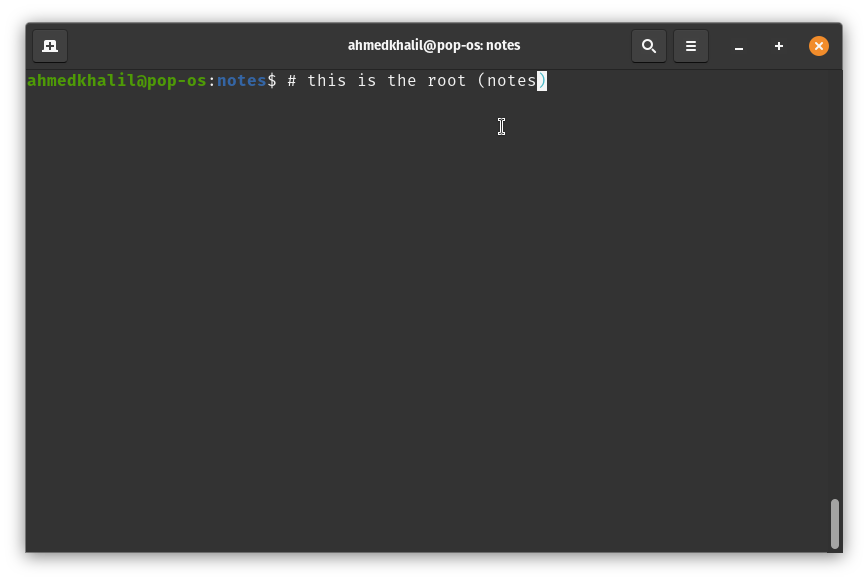
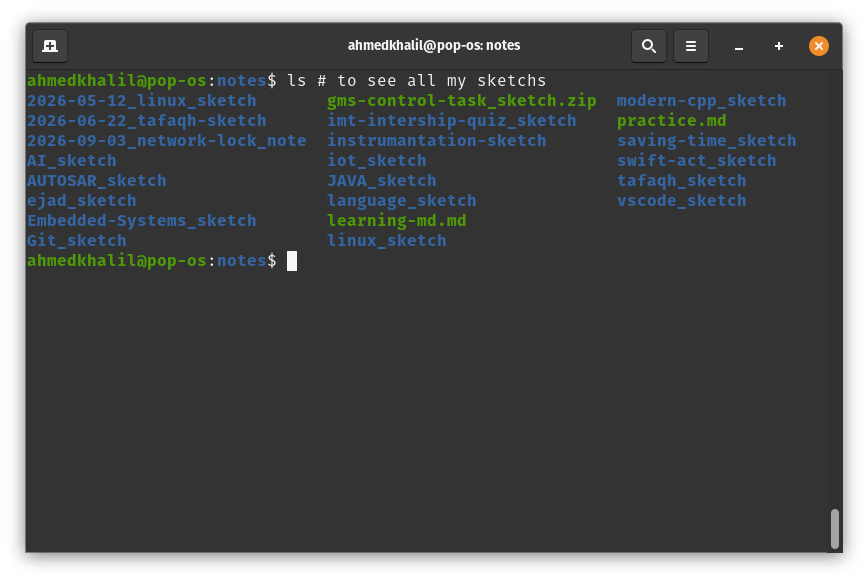
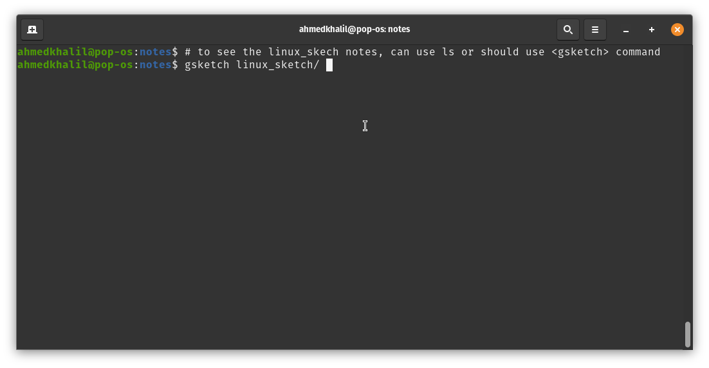
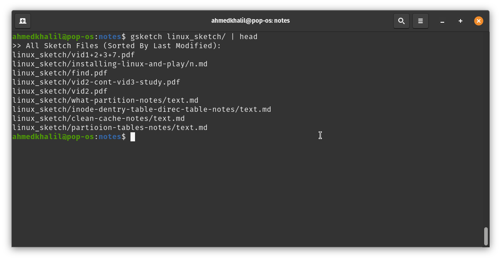
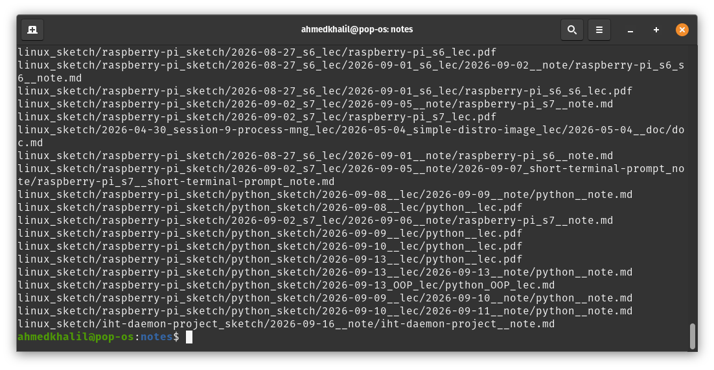
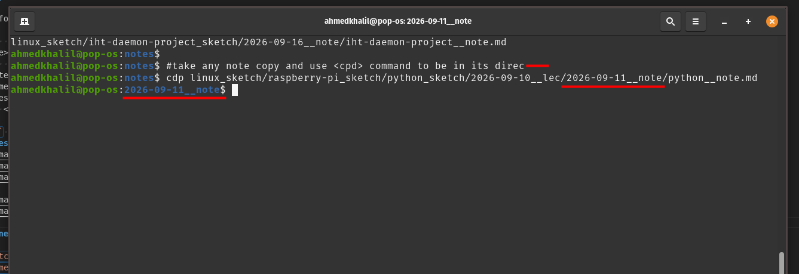
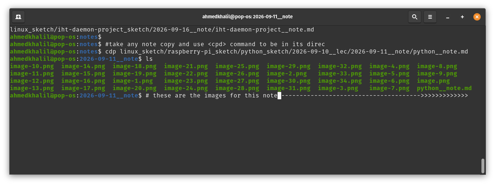
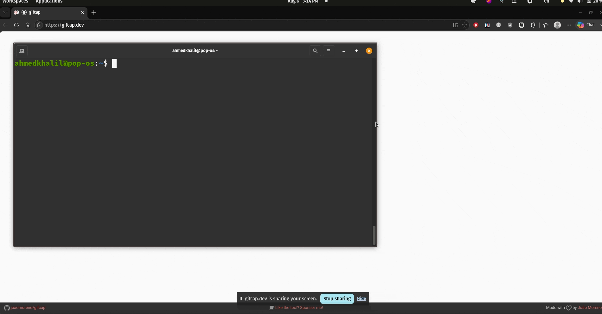

# ⚡ Full Desktop Note Automation

---


---

> A lightweight, keyboard-driven Linux workflow designed to capture, structure, and retain knowledge effortlessly while coding, studying, or watching lectures.

---

- [⚡ Full Desktop Note Automation](#-full-desktop-note-automation)
	- [🧪 Battle-Tested](#-battle-tested)
	- [🌟 Why Use This?](#-why-use-this)
	- [🛠️ Architecture \& Key Features](#️-architecture--key-features)
		- [0. Directory Structure \& CLI Tools](#0-directory-structure--cli-tools)
		- [My Real Notes Example](#my-real-notes-example)
			- [Command‑Line Interface (CLI)](#commandline-interface-cli)
		- [1. Instant Visual Capture](#1-instant-visual-capture)
		- [2. Smart Spaced Repetition Engine](#2-smart-spaced-repetition-engine)
		- [3. File \& Metadata Organisation](#3-file--metadata-organisation)
	- [🎹 Custom Keyboard Shortcuts](#-custom-keyboard-shortcuts)
	- [💻 Tech Stack \& Linux Magic](#-tech-stack--linux-magic)
		- [0. Native Linux Tools](#0-native-linux-tools)
		- [📦 1. Dependencies \& Installation](#-1-dependencies--installation)
			- [Required Tools](#required-tools)
			- [One‑Line Install (Ubuntu / Debian)](#oneline-install-ubuntu--debian)
			- [For Other Distributions](#for-other-distributions)
			- [Verification](#verification)
	- [🖥️ Platform Support](#️-platform-support)
- [بالعربي - ⚡ أتمتة كاملة لتدوين الملاحظات على سطح المكتب](#بالعربي----أتمتة-كاملة-لتدوين-الملاحظات-على-سطح-المكتب)
	- [🧪 مجرَّب](#-مجرَّب)
	- [🌟 ليه تستخدمه؟](#-ليه-تستخدمه)
	- [🛠️ الهيكل والمميزات الأساسية](#️-الهيكل-والمميزات-الأساسية)
		- [٠. هيكل المجلدات وأدوات سطر الأوامر](#٠-هيكل-المجلدات-وأدوات-سطر-الأوامر)
			- [أوامر التحكم (CLI)](#أوامر-التحكم-cli)
		- [١. التقاط بصري فوري](#١-التقاط-بصري-فوري)
		- [٢. مراجعة الملاحظات](#٢-مراجعة-الملاحظات)
		- [٣. تنظيم الملفات والبيانات](#٣-تنظيم-الملفات-والبيانات)
	- [🎹 اختصارات الكيبورد المخصصة](#-اختصارات-الكيبورد-المخصصة)
	- [💻 التقنيات وسحر لينكس](#-التقنيات-وسحر-لينكس)
	- [🖥️ الدعم على المنصات](#️-الدعم-على-المنصات)

---

## 🧪 Battle-Tested

This workflow has been continuously used in daily software engineering and study environments since **June 2026**, successfully managing technical documentation, lecture notes, C/C++ sketches, and Linux system notes.

---

## 🌟 Why Use This?

Taking notes while studying or debugging usually breaks your focus. Switching back and forth between your IDE, browser, screenshot software, and note editor wastes time and drains mental energy. This project automates the manual labour of documentation, so you can stay in **flow state**:

- **Zero Friction** – Capture screenshots directly into Markdown files with single keyboard shortcuts.
- **Organised by Design** – Auto‑arranges your work into structured directories (*Sketch*, *Lecs*, *Notes*).
- **Built‑in Retention** – Includes a Spaced Repetition script to review your notes effortlessly.
- **Native Linux Power** – Lightweight, fast, and uses standard Linux tools without bloated dependencies.

---

## 🛠️ Architecture & Key Features

### 0. Directory Structure & CLI Tools

- The workflow follows a simple but powerful organisational scheme:
```
mynotes/                           # your root directory
├── sketch_<name>/                 # each sketch represents a track/subject/project
│   ├── notes/                     # direct notes within the sketch
│   │   └── <datetime>_<note_name>.md
│   └── lec_<name>/                # lectures inside a sketch
│       └── notes/
│           └── <datetime>_<note_name>.md
```
- All `lectures` and `notes` are automatically prefixed with the current date and time, making chronological sorting trivial.
### My Real Notes Example
- 
- 
- 
- Loading ...
- 
- 
- 
- 
- 
#### Command‑Line Interface (CLI)

- `msketch "sketch name"`: **make sketch** – Creates a new sketch and changes into its directory.
- `mlec "lec name"`: **make lecture** – Creates a new lecture inside the current sketch, changes into it, and opens VS Code automatically.
- `mnote "note name"`: **make note** – Creates a new note in the current directory and opens VS Code.
- `gsketch-sorted`: **get sketch** – Lists all files inside the current sketch recursively, sorted by last modified date. You can also pipe the output to `sort` to order by the filename prefix (creation date).
- `gspaced-repetition`: **get/make spaced-repetition** – Launches the spaced repetition tool. It selects a manageable batch of notes from the last week, ~1 month ago, and ~3 months ago to reinforce memory. Arguments allow customisation of the time windows and batch size.
- `cdp`: change to the parent directory of the note/lec md file.
- 
---

### 1. Instant Visual Capture

- **Window Capture** – Press a shortcut to automatically capture the active window and append it directly to your current Markdown file.
- **Area Selection** – Select any region of the screen to grab snippets, diagrams, or code blocks instantly.
- **Auto‑Focus** – Keep your editor running in the background and toggle visual access without losing focus on your main task.

---

### 2. Smart Spaced Repetition Engine

The built‑in shell utility `mspaced-repetition`:
- Randomly samples your notes based on interval brackets (Last 7 Days, ~1 Month Ago, ~3 Months Ago).
- Caps reviews to small, manageable batches to prevent study burnout.
- Integrates native desktop notifications (`notify-send`) with randomised mindset reminders, keeping reviews fast and concept‑focused.

---

### 3. File & Metadata Organisation

- Automatically organises notes chronologically and structurally.
- Enables easy command‑line searching using standard UNIX utilities (`find`, `grep`, etc.).
- Fully compatible with standard Markdown renderers and PDF export tools (e.g., VS Code extensions).

---

## 🎹 Custom Keyboard Shortcuts

Designed to feel like native window management shortcuts (similar to `Alt+Tab`):

| Shortcut      | Action                                                                                    |
| :------------ | :---------------------------------------------------------------------------------------- |
| **`Alt + 1`** | Takes a screenshot of the active window and appends it to your current Markdown document. |
| **`Alt + 2`** | Prompts for a selected region screenshot and appends it to your Markdown document.        |
| **`Alt + 3`** | Toggles/opens your primary active Markdown note file.                                     |

---

## 💻 Tech Stack & Linux Magic

### 0. Native Linux Tools
This tool highlights the flexibility of native Linux environment scripting:

- **Shell Scripting (`bash`)** – Core logic leveraging standard utilities (`find`, `grep`, `mtime`, `sort`, `shuf`).
- **Display & Window Automation** – Uses `xdotool` and native desktop screenshot utilities to simulate human input and capture active windows.
- **Environment** – Works seamlessly with **VS Code** (or any preferred text editor/IDE).
- **Notifications** – Uses `notify-send` for non‑intrusive desktop reminders.


### 📦 1. Dependencies & Installation

Below you’ll find a brief description of each tool and a **single command that installs everything** at once on **Debian‑based** distributions (Ubuntu, Mint, etc.). For other distros, you can adapt the package manager accordingly.

#### Required Tools

| Tool              | Purpose                                                                                 |
| :---------------- | :-------------------------------------------------------------------------------------- |
| **xdotool**       | Simulates keyboard input and finds/manages windows (used to focus VSCode and paste).    |
| **flameshot**     | Interactive area screenshot tool (`flameshot gui`), used by the area‑capture script.    |
| **maim**          | Lightweight screenshot utility that captures a specific window (used in window‑capture).|
| **xclip**         | Manipulates the X selection (clipboard) – it holds the captured image for pasting.      |
| **libnotify-bin** | Provides `notify‑send`, which delivers desktop notifications (e.g., spaced‑repetition reminders). |
| **bc**            | Command‑line calculator; used to compute dynamic delays based on CPU load.              |
| **coreutils**     | (Always present) supplies `date`, `find`, `shuf`, `sort`, `grep`, `realpath`, etc.      |

> **Optional** – [Visual Studio Code](https://code.visualstudio.com/) (`code`) is used as the preferred Markdown editor, but you can replace it with any other editor in the scripts.

---

#### One‑Line Install (Ubuntu / Debian)

```bash
sudo apt update && sudo apt install -y xdotool flameshot maim xclip libnotify-bin bc
```

After installation, all scripts should work out‑of‑the‑box.

---

#### For Other Distributions

| Distro Family | Package Manager | Equivalent Command                                             |
| :------------ | :-------------- | :------------------------------------------------------------- |
| **Fedora**    | `dnf`           | `sudo dnf install xdotool flameshot maim xclip libnotify bc`   |
| **Arch Linux**| `pacman`        | `sudo pacman -S xdotool flameshot maim xclip libnotify bc`     |
| **openSUSE**  | `zypper`        | `sudo zypper install xdotool flameshot maim xclip libnotify bc`|

---

#### Verification

Once installed, you can test each component quickly:

```bash
xdotool --version
flameshot --version
maim --version
xclip -version
notify-send "Test" "Hello"   # should pop up a notification
echo "1.2 + 2.3" | bc        # should output 3.5
```

If all commands return without errors, you’re ready to go.

---

## 🖥️ Platform Support

- **Linux** – Fully supported natively (Ubuntu, Debian, Fedora, Arch, etc.).
- **Windows** – Compatible via WSL (Windows Subsystem for Linux) with display server mapping, or Cygwin environments.

---
---
---

# بالعربي - ⚡ أتمتة كاملة لتدوين الملاحظات على سطح المكتب

> نظام شغل خفيف يعتمد على الكيبورد في لينكس، مصمم عشان تلتقط، تنظم، وتثبت المعلومات من غير مجهود وأنت بتكتب كود، بتذاكر، أو بتتفرج على محاضرات.

---

## 🧪 مجرَّب

النظام ده شغال معايا من **يونيه ٢٠٢٦**، ملاحظات محاضرات، سكتشات C/C++، وملاحظات نظام لينكس.

---

## 🌟 ليه تستخدمه؟

لما تذاكر أو تصحح أخطاء، تدوين الملاحظات بيقطع تركيزك. التبديل بين editors، المتصفح، برنامج تصوير الشاشة بيضيع وقت وطاقة ذهنية. المشروع ده ب automate العمل اليدوي عشان تفضل في **نفس تركيزك**:

- **بدون احتكاك** – التقط صور للشاشة مباشرة في ملفات Markdown بضغطات كيبورد واحدة.
- **منظّم تلقائياً** – بيفرغ شغلك في مجلدات منظمة (سكتش، محاضرات، ملاحظات).
- **تثبيت مدمج** – فيه سكريبت مراجعة مكثفة (Spaced Repetition) عشان تراجع ملاحظاتك بسهولة.
- **قوة لينكس الأصيلة** – خفيف وسريع، بيستخدم أدوات لينكس العادية من غير حزم متضخمة.

---

## 🛠️ الهيكل والمميزات الأساسية

### ٠. هيكل المجلدات وأدوات سطر الأوامر

النظام بيتبع تنظيم بسيط لكن قوي:

```
mynotes/                           # مجلدك الرئيسي
├── sketch_<اسم>/                  # كل سكتش بيمثل مسار/مادة/مشروع
│   ├── notes/                     # ملاحظات مباشرة جوه السكتش
│   │   └── <وقت وتاريخ>_<اسم الملاحظة>.md
│   └── lec_<اسم>/                 # محاضرات جوه السكتش
│       └── notes/
│           └── <وقت وتاريخ>_<اسم الملاحظة>.md
```

كل المحاضرات والملاحظات بيضاف قدامها التاريخ والوقت تلقائياً، فبسهولة تترتب زمنياً.

#### أوامر التحكم (CLI)

- `msketch "اسم السكتش"` – بيعمل سكتش جديد ويدخل لك مجلده.
- `mlec "اسم المحاضرة"` – بيعمل محاضرة جديدة جوه السكتش الحالي، ويدخل لك مجلدها ويفتح VS Code أوتوماتيك.
- `mnote "اسم الملاحظة"` – بيعمل ملاحظة جديدة في المجلد الحالي ويفتح VS Code.
- `gsketch-sorted` – بيعرض كل الملفات جوه السكتش الحالي بالترتيب حسب تاريخ التعديل. تقدر تستخدم `sort` عشان ترتب حسب البادئة (تاريخ الإنشاء).
- `mspaced-repetition` – بيشغل أداة المراجعة المكثفة. بتيجي على عدد بسيط من الملاحظات من الأسبوع الأخير، ومن شهر تقريباً، ومن ٣ شهور عشان ترسخ المعلومة. تقدر تظبط الفترات وعدد الملاحظات بمعاملات إضافية.

---

### ١. التقاط بصري فوري

- **تصوير النافذة** – اضغط اختصار كيبورد عشان تتصور النافذة النشطة وتضيفها مباشرة لملف Markdown الحالي.
- **تحديد منطقة** – حدد أي جزء من الشاشة عشان تاخد مقطع، رسمة، أو بلوك كود.
- **تركيز تلقائي** – خلي المحرر شغال في الخلفية وافتح الرؤية البصرية من غير ما تفقد التركيز في مهمتك الأساسية.

---

### ٢. مراجعة الملاحظات

الأداة المدمجة `mspaced-repetition`:
- بتختار عشوائياً ملاحظات حسب فترات محددة (آخر ٧ أيام، شهر، ٣ شهور).
- بتحدد عدد المراجعات عشان تبقى كمية صغيرة ومتناسبة.
- بتستخدم إشعارات سطح المكتب (`notify-send`) مع تذكيرات عشوائية محفزة عشان تخلي المراجعة سريعة ومركزة على المفهوم.

---

### ٣. تنظيم الملفات والبيانات

- بترتب الملاحظات زمنياً وهيكلياً تلقائياً.
- بيخلي البحث من سطر الأوامر سهل باستخدام أدوات يونكس العادية (`find`, `grep`, إلخ).
- متوافق مع محررات Markdown وأدوات التصدير إلى PDF (زي إضافات VS Code).

---

## 🎹 اختصارات الكيبورد المخصصة

مصممة عشان تحسها زي اختصارات إدارة النوافذ الأصلية (زي `Alt+Tab`):

| الاختصار         | الإجراء                                                                                      |
| :--------------- | :------------------------------------------------------------------------------------------- |
| **`Alt + 1`**    | يصور النافذة النشطة ويضيف الصورة لملف Markdown الحالي.                                       |
| **`Alt + 2`**    | بيفتح لك اختيار منطقة على الشاشة ويضيف لقطة المنطقة لملف Markdown.                          |
| **`Alt + 3`**    | بيفتح/بيظهر ملف الملاحظات الأساسي النشط.                                                    |

---

## 💻 التقنيات وسحر لينكس

الأداة دي بتظهر مرونة بيئة لينكس في السكريبتات:

- **سكريبتات شل (`bash`)** – المنطق الأساسي بيستخدم أدوات يونكس العادية (`find`, `grep`, `mtime`, `sort`, `shuf`).
- **أتمتة النوافذ والشاشة** – بيستخدم `xdotool` وأدوات تصوير الشاشة الأصلية عشان يحاكي الإدخال البشري ويلتقط النوافذ النشطة.
- **البيئة** – شغالة بسلاسة مع **VS Code** (أو أي محرر/بيئة تطوير تفضلها).
- **الإشعارات** – بيستخدم `notify-send` لإشعارات سطح المكتب غير المزعجة.

---

## 🖥️ الدعم على المنصات

- **لينكس** – دعم كامل أصلي (أوبونتو، دبيان، فيدورا، آرتش، إلخ).
- **ويندوز** – متوافق عبر WSL (النظام الفرعي لويندوز للينكس) مع تعيين خادم العرض، أو بيئات Cygwin.